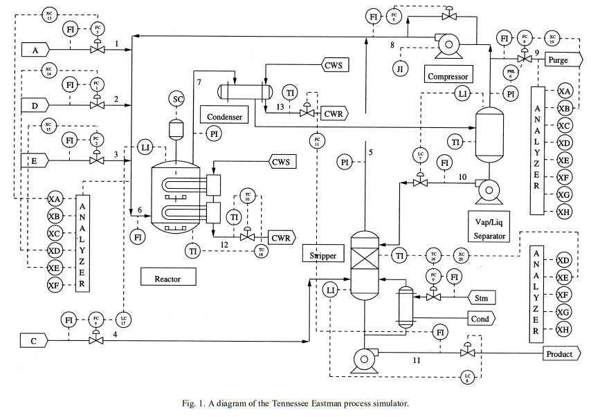
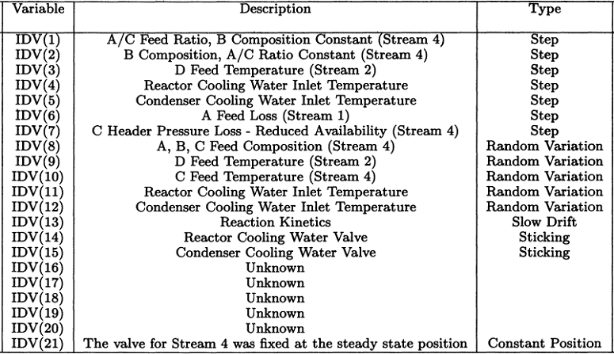

# Detecção de Anomalia

## Dataset: TEP

O simulador de processo do Tennessee Eastman foi criado pela Eastman Chemical Company para fornecer um processo industrial realista para avaliar o controle do processo e métodos de monitoramento. O simulador de processo Tennessee Eastman tem sido amplamente usado pela comunidade de monitoramento de processo como um fonte de dados para comparar várias abordagens. [2]

O problema de teste é baseado em um processo químico real onde os componentes, cinética e condições operacionais foram modificadas para razões proprietárias. Um diagrama do processo está contido na Figura 1. O código de simulação permite 21 interrupções principais do processo pré-programadas, conforme mostrado na Tabela 1. A estrutura de controle de toda a planta recomendada em Lyman e Georgakis [1] foi implementado para gerar os dados do processo simulado em malha fechada para cada falha. [2]

## Conteúdo

Cada arquivo **.RData** é uma representação externa de um dataframe em R que pode ser lido em um ambiente R com a função 'load'. As variáveis carregadas são chamadas de 'faultfreetraining', 'faultfreetesting', 'faultytesting', and 'faultytraining', correspondendo aos arquivos RData.

Cada dataframe contém 55 colunas:

- A coluna 1 ('faultNumber') varia de 1 a 20 nos conjuntos de dados "com defeito" e representa o tipo de falha no TEP. Os conjuntos de dados "FaultFree" contém apenas a falha 0 (ou seja, condições normais de operação).

- A coluna 2 ('simulationRun') varia de 1 a 500 e representa um estado do gerador de número aleatório diferente a partir do qual um conjunto de dados TEP completo foi gerado (Nota: as sementes reais usadas para gerar conjuntos de dados de treinamento e teste não se sobrepõem).

- A coluna 3 ('sample') varia de 1 a 500 (conjuntos de dados de "Treinamento") ou de 1 a 960 (conjuntos de dados de "Teste"). As variáveis TEP (colunas 4 a 55) foram amostradas a cada 3 minutos por uma duração total de 25 horas e 48 horas, respectivamente. Observe que as falhas foram introduzidas em 1 e 8 horas nos conjuntos de dados Faulty Training e Faulty Testing, respectivamente.

- As colunas 4 a 55 contém as variáveis do processo; os nomes das colunas retêm os nomes das variáveis originais.

## Referências

[1] P.R. Lyman, C. Georgakis, Comput. Chem. Eng. 19 (1995) 321–331.

[2] E. L. Russell, L. H. Chiang, and R. D. Braatz, "Fault detection in industrial processes using canonical variate analysis and dynamic principal component analysis", Chemometrics and Intelligent Laboratory Systems, vol. 51, no. 1, pp. 81–93, 2000.