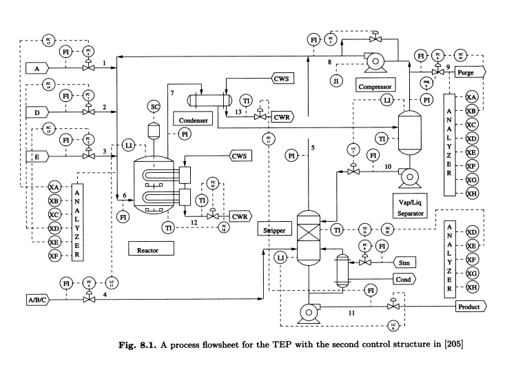
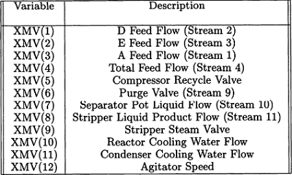
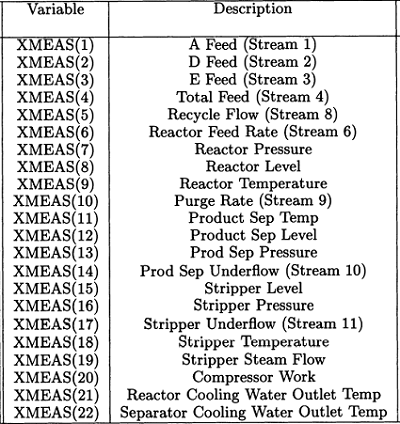
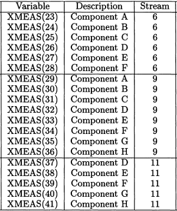
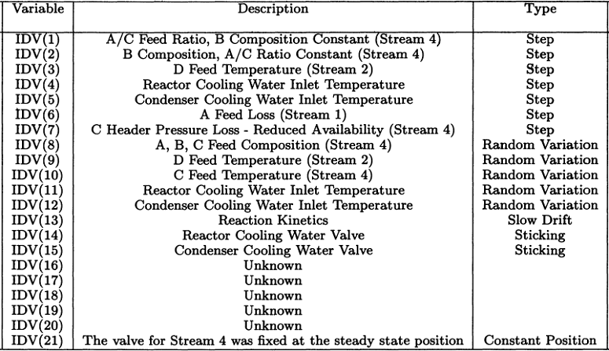

# Detecção de Anomalia

## Dataset: TEP

O simulador de processo do Tennessee Eastman foi criado pela Eastman Chemical Company para fornecer um processo industrial realista para avaliar o controle do processo e métodos de monitoramento. O simulador de processo Tennessee Eastman tem sido amplamente usado pela comunidade de monitoramento de processo como um fonte de dados para comparar várias abordagens. [2]

O problema de teste é baseado em um processo químico real onde os componentes, cinética e condições operacionais foram modificadas para razões proprietárias. Um diagrama do processo está contido na Figura 8.1. A estrutura de controle de toda a planta recomendada em **Lyman** e **Georgakis** [1] foi implementado para gerar os dados do processo simulado em malha fechada para cada falha. [2]

### Variáveis do processo

O processo contém 41 variáveis medidas e 12 variáveis manipuladas. As variáveis manipuladas são listadas abaixo.

As 22 variáveis medidas XMEAS(1) até XMEAS(22) são listadas abaixo.

As 19 medidas de composição, XMEAS(23) até XMEAS(41), 
são descritas na tabela a seguir. As medidas de composição são tiradas das correntes 6, 9, e 11.

### Falhas do processo

A simulação TEP  contém 21 falhas preprogramadas (tabela abaixo). Dezesseis dessas falhas são conhecidas, e cinco são desconhecidas. Falhas 1-7 são associadas com uma mudança de patamar de uma variável de processo, por exemplo, a temperatura de entrada de água de resfriamento ou composição da corrente de entrada. Falhas 8-12 são associadas com um aumento na variabilidade de algumas variáveis do processo. Falha 13 é uma lenta mudança de ponto de operação na reação cinética, e falhas 14, 15, e 21 são associadas com válvulas emperradas.

## Conteúdo

Cada arquivo **.RData** é uma representação externa de um dataframe em R que pode ser lido em um ambiente R com a função 'load'. As variáveis carregadas são chamadas de 'faultfreetraining', 'faultfreetesting', 'faultytesting', and 'faultytraining', correspondendo aos arquivos RData.

Cada dataframe contém 55 colunas:

- A coluna 1 ('faultNumber') varia de 1 a 20 nos conjuntos de dados "com defeito" e representa o tipo de falha no TEP. Os conjuntos de dados "FaultFree" contém apenas a falha 0 (ou seja, condições normais de operação).

- A coluna 2 ('simulationRun') varia de 1 a 500 e representa um estado do gerador de número aleatório diferente a partir do qual um conjunto de dados TEP completo foi gerado (Nota: as sementes reais usadas para gerar conjuntos de dados de treinamento e teste não se sobrepõem).

- A coluna 3 ('sample') varia de 1 a 500 (conjuntos de dados de "Treinamento") ou de 1 a 960 (conjuntos de dados de "Teste"). As variáveis TEP (colunas 4 a 55) foram amostradas a cada 3 minutos por uma duração total de 25 horas e 48 horas, respectivamente. Observe que as falhas foram introduzidas em 1 e 8 horas nos conjuntos de dados Faulty Training e Faulty Testing, respectivamente.

- As colunas 4 a 55 contém as variáveis do processo; os nomes das colunas retêm os nomes das variáveis originais.

## Referências

[1] P.R. Lyman, C. Georgakis, Comput. Chem. Eng. 19 (1995) 321–331.

[2] E. L. Russell, L. H. Chiang, and R. D. Braatz, "Fault detection in industrial processes using canonical variate analysis and dynamic principal component analysis", *Chemometrics and Intelligent Laboratory Systems*, vol. 51, no. 1, pp. 81–93, 2000.

[3] L. Chiang, E. Russell, and R. Braatz, *Fault Detection and Diagnosis in Industrial Systems*. London: Springer, 2001.